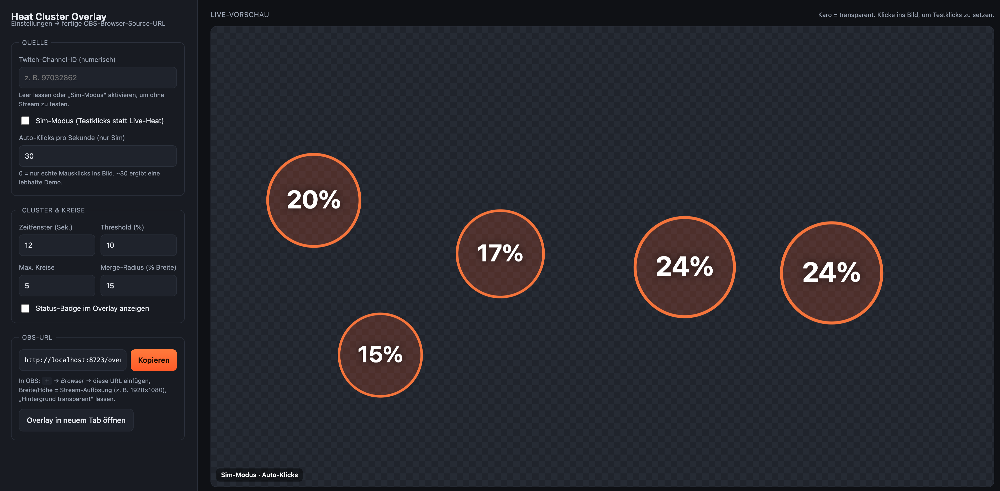

# Heat Click-Cluster Overlay

Ein OBS-Overlay, das Zuschauer-Klicks auf den Twitch-Videoplayer live zu Hotspot-Kreisen
clustert. Die Klick-Daten liefert die [Heat](https://github.com/scottgarner/Heat) Twitch
Extension. Bis zu 5 Kreise; jeder zeigt seinen prozentualen Anteil an den Klicks innerhalb
eines gleitenden Zeitfensters. Ein Kreis erscheint erst ab einem Mindestanteil (Threshold).

Reiner Proof of Concept: nur Visualisierung — kein Backend, keine Dependencies, kein Build.



## Schnellstart

1. **`config.html` öffnen** (Doppelklick genügt, oder über einen lokalen Server – siehe unten).
2. **Sim-Modus** anhaken und **Auto-Klicks** auf z. B. `30` stellen → in der Live-Vorschau
   entstehen Kreise. Alternativ: für Live-Betrieb die **Twitch-Channel-ID** eintragen.
3. **„Kopieren"** klickt die fertige OBS-URL in die Zwischenablage.
4. In **OBS**: `+` → *Browser* → URL einfügen, Breite/Höhe = Stream-Auflösung (z. B. 1920×1080),
   Hintergrund transparent lassen.

> Die [Heat Twitch Extension](https://dashboard.twitch.tv/extensions/cr20njfkgll4okyrhag7xxph270sqk)
> muss vom Kanalinhaber im Twitch-Dashboard installiert und aktiviert sein, damit echte
> Klicks ankommen.

## Channel-ID finden

Heat braucht die **numerische** Twitch-User-ID des Kanals (nicht den Anzeigenamen).

- **Am einfachsten – [DecAPI](https://decapi.me/):** im Browser
  `https://decapi.me/twitch/id/DEIN_USERNAME` aufrufen → gibt direkt die Zahl zurück
  (z. B. `97032862`). Kein Login nötig.
- **Converter-Tool:** z. B. [streamweasels.com](https://www.streamweasels.com/tools/convert-twitch-username-to-user-id/)
  – Username eintippen, ID ablesen.
- **Offiziell per Twitch-API** (nur falls du ohnehin eine App/Token hast):
  `GET https://api.twitch.tv/helix/users?login=DEIN_USERNAME` → Feld `id`.

Die Zahl ins Feld „Twitch-Channel-ID" der `config.html` eintragen. Bleibt das Overlay leer,
ist meist die Extension nicht aktiv oder es klickt gerade niemand – dann erst im Sim-Modus testen.

## Dateien

```
overlay.html          OBS-Overlay (transparent, vollflächiges Canvas)
config.html           Einstell-UI + Live-Vorschau + OBS-URL-Generator (merkt Werte in localStorage)
js/heat-overlay.js    Logik: source / buffer / clusterer / renderer
CLAUDE.md             Projektdoku
docs/superpowers/specs Design-Dokument
```

## URL-Parameter (overlay.html)

| Param        | Default | Bedeutung |
|--------------|---------|-----------|
| `channel`    | —       | Twitch-Channel-ID (numerisch) für Live-Heat. Fehlt sie → Sim-Modus. |
| `sim`        | `0`     | `1` erzwingt Sim-Modus (ignoriert `channel`). |
| `autoclicks` | `0`     | Sim: automatische Klicks pro Sekunde (0 = nur echte Mausklicks). |
| `window`     | `12`    | Gleitendes Zeitfenster in Sekunden. |
| `threshold`  | `10`    | Mindestanteil in % für einen Kreis. |
| `maxCircles` | `5`     | Max. Anzahl Kreise. |
| `mergeRadius`| `8`     | Cluster-Merge-Radius in % der Breite. |
| `status`     | `0`     | `1` zeigt ein kleines Status-Badge (Verbindung/Modus). |
| `mode`       | `cluster` | `zones` = feste Zonen statt Auto-Cluster. |
| `zones`      | —       | Feste Vierecke `x1,y1,…,x4,y4`, mehrere durch `;` (nur `mode=zones`). |

`config.html` baut diese URL für dich zusammen.

## Braucht es einen Server?

Im Normalbetrieb **nein** – OBS lädt `overlay.html` direkt per `file://`-Pfad, und der
WebSocket zu Heat läuft auch von dort. Ein lokaler Server (`python3 -m http.server`) hilft nur,
falls dein OBS/Browser bei `file://` zickt oder der „Kopieren"-Button zuverlässig die
Clipboard-API nutzen soll (die braucht http/localhost).

## So funktioniert Heat (Kurzfassung)

- WebSocket: `wss://heat-api.j38.net/channel/<channelId>` (channelId = numerische Twitch-User-ID).
- Klick-Nachricht: `{ type: "click", x, y, id }` mit **x/y normalisiert (0..1)** → auflösungsunabhängig.
- `id` = Twitch-User-ID, oder `A…` (anonym) / `U…` (Identität nicht geteilt). Im PoC ungenutzt.

## Nicht im Scope (PoC)

Nutzer-Identität, Aktions-Schicht (OBS-Steuerung, Webhooks, n8n), Persistenz, eigenes Relay.
Das sind die nächsten Ausbauschritte.
